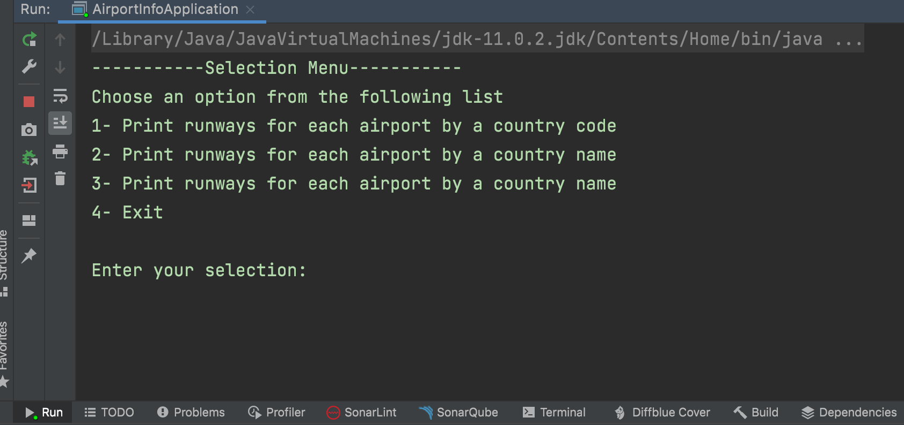
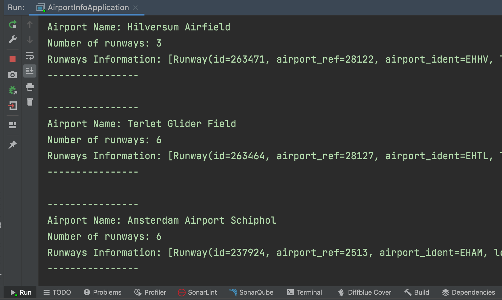
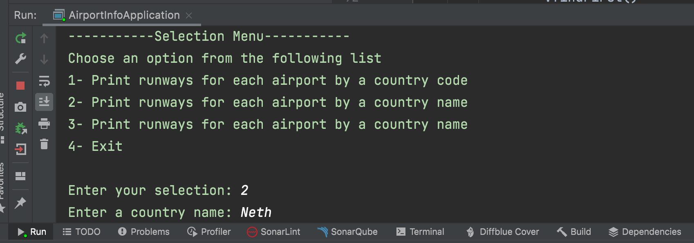
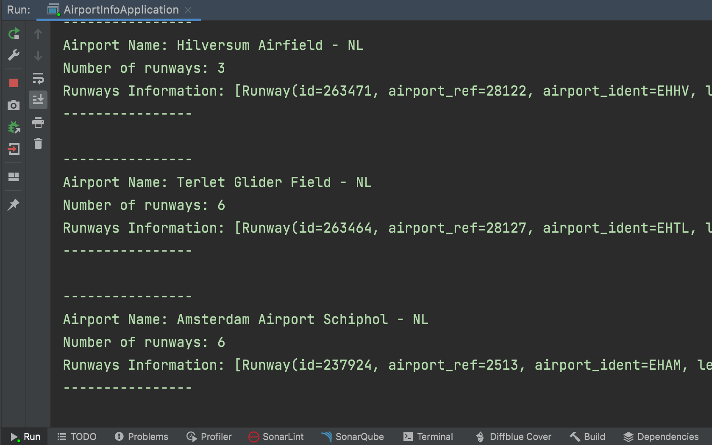

# AirportInfo

* This is a java console application. 

## Why did I build this project?

* This is the Accenture Java developer assessment. So I built this project to go to the next step in the hiring process.

## What does this application do?
The project has 3 CSV files. The files contain data for countries, airports and runways.

The program retrieves the following information from the provided files:
* Runways for each airport given a country code or country name.
* Top 10 countries with the highest number of airports.

Note: Support retrieving the information given a partial/fuzzy country code/name as input parameter,
e.g. entering 'zimb' will result in 'Zimbabwe'. 

## Installation

* Clone this repository,
* Make sure you are using JDK 11 and Maven 3.x,
* If you want to run app in your terminal or cmd:
  + Go to project file,
  + Run below commands:
    + `mvn compile`
    + `mvn exec:java -Dexec.mainClass=com.accenture.airportinfo.AirportInfoApplication`

* OR you can build the project and run it by using your own IDE.

## Which technologies and projects are used in this app
* Java
* Opencsv
* Lombok

## Usage

* Simply, you can use this application follow the selection menu directives.

* After running the program, the selection menu below comes to your console.

* If select the first option, then you can enter the country code like below.

* And the program retrieves the result of search according to the country code.

* If select the second option, you can search by using country name. You also don't need to write full name of country.

* And again the program retrieves the result.

## Challenges
* While searching, the program was bringing the result a little late. 
  * I solved this problem by using static initializer, static methods, and hashmap. At first search, all data in CSV files convert to related models and assign to the data fields of the service. So that, when need to use the data after the first usage, the program is retrieving results faster than.